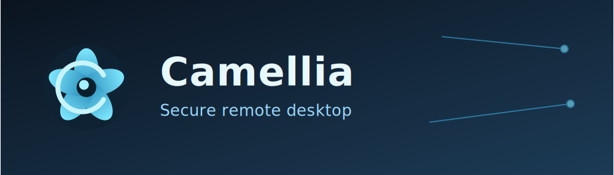
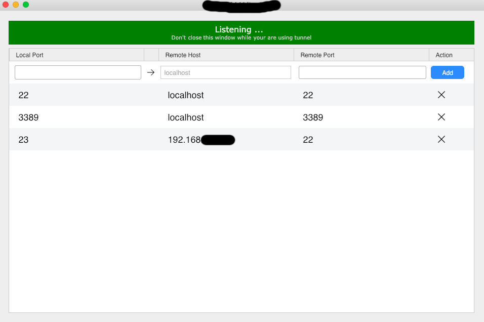

<p align="center">
  <br>
  <a href="#grobe-schritte-zum-kompilieren">Kompilieren</a>
  <a href="#auf-docker-kompilieren">Docker</a>
  <a href="#dateistruktur">Dateistruktur</a>
  <br>
  [<a href="docs/README-UA.md">Українська</a>] | [<a href="docs/README-CS.md">česky</a>] | [<a href="docs/README-ZH.md">中文</a>] | [<a href="docs/README-HU.md">Magyar</a>] | [<a href="docs/README-ES.md">Español</a>] | [<a href="docs/README-FA.md">فارسی</a>] | [<a href="docs/README-FR.md">Français</a>] | [<a href="docs/README-DE.md">Deutsch</a>] | [<a href="docs/README-PL.md">Polski</a>] | [<a href="docs/README-ID.md">Indonesian</a>] | [<a href="docs/README-FI.md">Suomi</a>] | [<a href="docs/README-ML.md">മലയാളം</a>] | [<a href="docs/README-JP.md">日本語</a>] | [<a href="docs/README-NL.md">Nederlands</a>] | [<a href="docs/README-IT.md">Italiano</a>] | [<a href="docs/README-RU.md">Русский</a>] | [<a href="docs/README-PTBR.md">Português (Brasil)</a>] | [<a href="docs/README-EO.md">Esperanto</a>] | [<a href="docs/README-KR.md">한국어</a>] | [<a href="docs/README-AR.md">العربي</a>] | [<a href="docs/README-VN.md">Tiếng Việt</a>] | [<a href="docs/README-DA.md">Dansk</a>] | [<a href="docs/README-GR.md">Ελληνικά</a>] | [<a href="docs/README-TR.md">Türkçe</a>] | [<a href="docs/README-NO.md">Norsk</a>] | [<a href="docs/README-RO.md">Română</a>] •
  <a href="#screenshots">Screenshots</a><br>
  <b>Wir brauchen Ihre Hilfe, um dieses README, die <a href="https://github.com/CamelliaCorp/camellia/tree/master/src/lang">Camellia-Benutzeroberfläche</a> und die <a href="https://github.com/CamelliaCorp/camellia">Dokumentation</a> in Ihre Muttersprache zu übersetzen.</b>
</p>

License: GNU Affero General Public License v3.0 (AGPL-3.0). See LICENCE.


> [!Caution]
> **Haftungsausschluss bei Missbrauch::** <br>
> Die Entwickler von Camellia billigen oder unterstützen keine unethische oder illegale Nutzung dieser Software. Missbrauch, wie unbefugter Zugriff, unbefugte Kontrolle oder Verletzung der Privatsphäre, verstößt strikt gegen unsere Richtlinien. Die Autoren sind nicht verantwortlich für jeglichen Missbrauch der Anwendung.


Contact: contact@aimmv.com | GitHub: https://github.com/CamelliaCorp/camellia

[](https://camellia.aimmv.com/pricing.html)

Camellia ist eine in Rust geschriebene Remote-Desktop-Software, die out of the box ohne besondere Konfiguration funktioniert. Sie haben die volle Kontrolle über Ihre Daten und müssen sich keine Sorgen um die Sicherheit machen. Sie können unseren Rendezvous/Relay-Server nutzen, [einen eigenen Server aufsetzen](https://camellia.aimmv.com/server) oder [einen eigenen Server programmieren](https://github.com/CamelliaCorp/camellia).


Camellia heißt jegliche Mitarbeit willkommen. Schauen Sie sich [CONTRIBUTING-DE.md](CONTRIBUTING-DE.md) an, wenn Sie Unterstützung beim Start brauchen.

[**FAQ**](https://github.com/CamelliaCorp/camellia/wiki/FAQ)

[**Programm herunterladen**](https://github.com/CamelliaCorp/camellia/releases)

[**Nightly Builds**](https://github.com/CamelliaCorp/camellia/releases/tag/nightly)

[](https://f-droid.org/en/packages/com.carriez.flutter_hbb)
[](https://flathub.org/apps/com.camellia.Camellia)

## Abhängigkeiten

Desktop-Versionen verwenden [Sciter](https://sciter.com/) oder Flutter für die GUI, dieses Tutorial ist nur für Sciter.

Bitte laden Sie die dynamische Bibliothek Sciter selbst herunter.

[Windows](https://raw.githubusercontent.com/c-smile/sciter-sdk/master/bin.win/x64/sciter.dll) |
[Linux](https://raw.githubusercontent.com/c-smile/sciter-sdk/master/bin.lnx/x64/libsciter-gtk.so) |
[macOS](https://raw.githubusercontent.com/c-smile/sciter-sdk/master/bin.osx/libsciter.dylib)

## Grobe Schritte zum Kompilieren

- Bereiten Sie Ihre Rust-Entwicklungsumgebung und C++-Build-Umgebung vor

- Installieren Sie [vcpkg](https://github.com/microsoft/vcpkg) und fügen Sie die Systemumgebungsvariable `VCPKG_ROOT` hinzu

  - Windows: `vcpkg install libvpx:x64-windows-static libyuv:x64-windows-static opus:x64-windows-static aom:x64-windows-static`
  - Linux/macOS: `vcpkg install libvpx libyuv opus aom`

- Nutzen Sie `cargo run`

## [Erstellen](https://camellia.aimmv.com/docs/de/dev/build/)

## Kompilieren auf Linux

### Ubuntu 18 (Debian 10)

```sh
sudo apt install -y zip g++ gcc git curl wget nasm yasm libgtk-3-dev clang libxcb-randr0-dev libxdo-dev \
        libxfixes-dev libxcb-shape0-dev libxcb-xfixes0-dev libasound2-dev libpulse-dev cmake make \
        libclang-dev ninja-build libgstreamer1.0-dev libgstreamer-plugins-base1.0-dev libpam0g-dev
```

### openSUSE Tumbleweed

```sh
sudo zypper install gcc-c++ git curl wget nasm yasm gcc gtk3-devel clang libxcb-devel libXfixes-devel cmake alsa-lib-devel gstreamer-devel gstreamer-plugins-base-devel xdotool-devel pam-devel
```

### Fedora 28 (CentOS 8)

```sh
sudo yum -y install gcc-c++ git curl wget nasm yasm gcc gtk3-devel clang libxcb-devel libxdo-devel libXfixes-devel pulseaudio-libs-devel cmake alsa-lib-devel gstreamer1-devel gstreamer1-plugins-base-devel pam-devel
```

### Arch (Manjaro)

```sh
sudo pacman -Syu --needed unzip git cmake gcc curl wget yasm nasm zip make pkg-config clang gtk3 xdotool libxcb libxfixes alsa-lib pipewire
```

### vcpkg installieren

```sh
git clone https://github.com/microsoft/vcpkg
cd vcpkg
git checkout 2023.04.15
cd ..
vcpkg/bootstrap-vcpkg.sh
export VCPKG_ROOT=$HOME/vcpkg
vcpkg/vcpkg install libvpx libyuv opus aom
```

### libvpx reparieren (für Fedora)

```sh
cd vcpkg/buildtrees/libvpx/src
cd *
./configure
sed -i 's/CFLAGS+=-I/CFLAGS+=-fPIC -I/g' Makefile
sed -i 's/CXXFLAGS+=-I/CXXFLAGS+=-fPIC -I/g' Makefile
make
cp libvpx.a $HOME/vcpkg/installed/x64-linux/lib/
cd
```

### Kompilieren

```sh
curl --proto '=https' --tlsv1.2 -sSf https://sh.rustup.rs | sh
source $HOME/.cargo/env
git clone --recurse-submodules https://github.com/CamelliaCorp/camellia
cd camellia
mkdir -p target/debug
wget https://raw.githubusercontent.com/c-smile/sciter-sdk/master/bin.lnx/x64/libsciter-gtk.so
mv libsciter-gtk.so target/debug
VCPKG_ROOT=$HOME/vcpkg cargo run
```

## Auf Docker kompilieren

Beginnen Sie damit, das Repository zu klonen und den Docker-Container zu bauen:

```sh
git clone https://github.com/CamelliaCorp/camellia
cd camellia
git submodule update --init --recursive
docker build -t "camellia-builder" .
```

Führen Sie jedes Mal, wenn Sie das Programm kompilieren müssen, folgenden Befehl aus:

```sh
docker run --rm -it -v $PWD:/home/user/camellia -v camellia-git-cache:/home/user/.cargo/git -v camellia-registry-cache:/home/user/.cargo/registry -e PUID="$(id -u)" -e PGID="$(id -g)" camellia-builder
```

Bedenken Sie, dass das erste Kompilieren länger dauern kann, bis die Abhängigkeiten zwischengespeichert sind. Nachfolgende Kompiliervorgänge sind schneller. Wenn Sie verschiedene Argumente für den Kompilierbefehl angeben müssen, können Sie dies am Ende des Befehls an der Position `<OPTIONAL-ARGS>` tun. Wenn Sie zum Beispiel eine optimierte Releaseversion kompilieren wollen, können Sie `--release` am Ende des Befehls anhängen. Das daraus entstehende Programm finden Sie im Zielordner auf Ihrem System. Sie können es mit folgendem Befehl ausführen:

```sh
target/debug/camellia
```

Oder, wenn Sie eine Releaseversion benutzen:

```sh
target/release/camellia
```

Bitte stellen Sie sicher, dass Sie diese Befehle im Stammverzeichnis des Camellia-Repositorys nutzen. Ansonsten kann es passieren, dass das Programm die Ressourcen nicht finden kann. Bitte bedenken Sie auch, dass andere Cargo-Unterbefehle wie `install` oder `run` aktuell noch nicht unterstützt werden, da sie das Programm innerhalb des Containers starten oder installieren würden, anstatt auf Ihrem eigentlichen System.

## Dateistruktur

- **[libs/hbb_common](https://github.com/CamelliaCorp/camellia/tree/master/libs/hbb_common)**: Video-Codec, Konfiguration, TCP/UDP-Wrapper, Protokoll-Puffer, fs-Funktionen für Dateitransfer und ein paar andere nützliche Funktionen
- **[libs/scrap](https://github.com/CamelliaCorp/camellia/tree/master/libs/scrap)**: Bildschirmaufnahme
- **[libs/enigo](https://github.com/CamelliaCorp/camellia/tree/master/libs/enigo)**: Plattformspezifische Maus- und Tastatursteuerung
- **[libs/clipboard](https://github.com/CamelliaCorp/camellia/tree/master/libs/clipboard)**: Datei kopieren und einfügen Implementierung für Windows, Linux, macOS.
- **[src/ui](https://github.com/CamelliaCorp/camellia/tree/master/src/ui)**: GUI
- **[src/server](https://github.com/CamelliaCorp/camellia/tree/master/src/server)**: Audio/Zwischenablage/Eingabe/Videodienste und Netzwerkverbindungen
- **[src/client.rs](https://github.com/CamelliaCorp/camellia/tree/master/src/client.rs)**: Starten einer Peer-Verbindung
- **[src/rendezvous_mediator.rs](https://github.com/CamelliaCorp/camellia/tree/master/src/rendezvous_mediator.rs)**: Mit [Camellia server](https://github.com/CamelliaCorp/camellia) kommunizieren, warten auf direkte (TCP hole punching) oder weitergeleitete Verbindung
- **[src/platform](https://github.com/CamelliaCorp/camellia/tree/master/src/platform)**: Plattformspezifischer Code
- **[flutter](https://github.com/CamelliaCorp/camellia/tree/master/flutter)**: Flutter-Code für Handys
- **[flutter/web/js](https://github.com/CamelliaCorp/camellia/tree/master/flutter/web/js)**: JavaScript für Flutter-Webclient


## Screenshots




